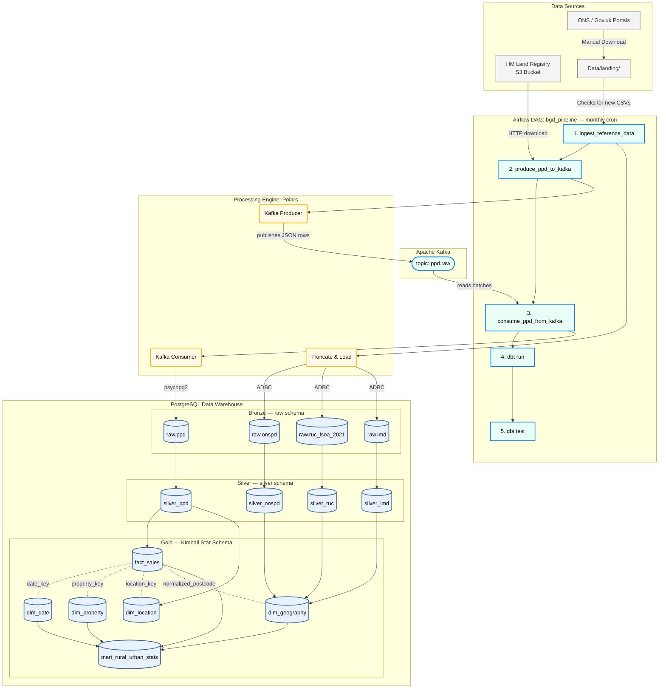

# UK Property Market Analysis – Data Warehouse

## Problem Statement (Analytical Goal)
The primary analytical goal of this data warehouse is to enrich raw UK Property Price Data (PPD) with granular socio-economic context (Index of Multiple Deprivation - IMD) and geographic classifications (Rural-Urban Classification - RUC). By unifying these disparate datasets, we enable analysts and business users to answer critical real estate queries:
- How do property prices and transaction volumes vary across different property types, new builds, and along the rural-urban spectrum?
- To what extent do local neighborhood deprivation factors (e.g., crime rates, education quality, living environment) influence housing valuations?
- What are the long-term trends in property sales when evaluated against neighborhood quality and geographic density?

---

## Architecture Overview

The project follows a **Medallion Architecture** (Bronze → Silver → Gold) orchestrated by **Apache Airflow**, powered by **Polars** for high-speed ingestion, and buffered by **Apache Kafka** for decoupled, fault-tolerant streaming of PPD data into the Bronze layer. All transformations from Silver onwards are managed by **dbt**.

```
┌─────────────────────────────────────────────────────────────────┐
│  Data Sources (UK Gov)                                          │
│  • PPD  – auto-downloaded by Polars from Land Registry URLs     │
│  • ONSPD / RUC / IMD – manually dropped into Data/landing/      │
└──────────┬──────────────────────────────────────────────────────┘
           ▼
┌─────────────────────────────────────────────────────────────────┐
│  Airflow DAG: bgd_pipeline  (runs 25th of each month)           │
│                                                                 │
│  1. ingest_reference_data │ Polars Truncate & Load → Bronze     │
│  2. produce_ppd_to_kafka  │ Polars + Kafka Producer → ppd.raw   │
│  3. consume_ppd_from_kafka│ Kafka Consumer → psycopg2 → Bronze  │
│  4. dbt_run               │ Builds all Silver & Gold dbt models │
│  5. dbt_test              │ dbt test (checks data quality)      │
└──────────┬──────────────────────────────────────────────────────┘
           ▼
┌─────────────────────────────────────────────────────────────────┐
│  PostgreSQL (Kimball Star Schema)                               │
│  • dim_geography  • dim_property  • dim_location  • dim_date    │
│  • fact_sales     • mart_rural_urban_stats                      │
└─────────────────────────────────────────────────────────────────┘
```




### Processing Paradigm
This is a **batch processing** pipeline. The UK Land Registry publishes Price Paid Data updates roughly on the 20th working day of each month. Airflow is scheduled to run on the **25th** as a safe buffer. Reference datasets (ONSPD, RUC, IMD) update infrequently (quarterly/annually) and are loaded via a file-drop landing zone pattern.

---

## Repository Structure

```
BGD/
├── airflow/
│   └── dags/
│       └── bgd_pipeline.py          # Airflow DAG (orchestration logic)
├── bgd_dbt/
│   ├── models/
│   │   ├── schema.yml                # dbt data quality constraints (15 test assertions)
│   │   ├── silver/                   # Cleansing & standardization layer
│   │   │   ├── silver_ppd.sql        # Incremental, unique on transaction_id
│   │   │   ├── silver_onspd.sql
│   │   │   ├── silver_ruc.sql
│   │   │   └── silver_imd.sql
│   │   └── gold/                     # Kimball Star Schema
│   │       ├── dim_geography.sql
│   │       ├── dim_property.sql
│   │       ├── dim_location.sql
│   │       ├── dim_date.sql
│   │       ├── fact_sales.sql
│   │       └── mart_rural_urban_stats.sql
│   ├── docker_profiles/profiles.yml  # dbt profile for container networking
│   └── dbt_project.yml
├── Data/
│   ├── landing/                      # Drop reference CSVs here for Airflow
│   ├── pp-complete.csv               # 30M+ row PPD history (not in Git)
│   └── ONSPD_FEB_2026/              # ONS Postcode Directory (not in Git)
├── docker-entrypoint-initdb.d/       # Bootstrap scripts (first-run schema + data)
│   ├── 00_schema.sql
│   ├── 01_ppd.sql
│   ├── 02_onspd.sql
│   ├── 03_ruc.sql
│   └── 04_imd.sql
├── docs/
│   ├── HLD.png                       # High-level overview diagram (executive/newcomer view)
│   ├── architecture_detailed.png     # Full architecture diagram with all technologies
│   └── data_warehousing_project_diagram.png  # Pipeline flow diagram (alternative layout)
├── bgd_dbt/tests/
│   ├── assert_fact_sales_price_positive.sql  # Validity: price > 0
│   ├── assert_fact_sales_min_row_count.sql   # Row count: ≥ 29M rows
│   └── assert_fact_sales_freshness.sql       # Freshness: MAX(transfer_date) < 40 days
├── kafka/
│   ├── ppd_producer.py               # Polars downloads PPD → publishes to Kafka
│   └── ppd_consumer.py               # Consumes Kafka topic → upserts via psycopg2
├── docker-compose.yml                # Postgres + pgAdmin + Airflow + Kafka + Zookeeper
├── data_product_contract.yaml        # Data Product Contract (ODCS v3.1.0)
├── ingest_to_bronze.py               # Polars PPD ingestion (Bronze); reference data handled by DAG
├── requirements.txt
├── ORCHESTRATION_README.md           # Detailed Airflow usage guide
└── README.md                         # ← You are here
```

---

## Medallion Layers (dbt)

### 1. Silver Layer (Staging & Cleansing)
- **`silver_ppd`**: Normalizes postcodes (`UPPER(REPLACE(postcode,' ',''))` → `normalized_postcode`), uses the Land Registry's natural `transaction_id` UUID as the incremental unique key. Runs incrementally — only processes rows with `transfer_date` newer than the current Silver max.
- **`silver_onspd`**: Filters out null postcodes, generates an SCD2-style surrogate key (`onspd_key`) via `MD5(normalized_postcode || dointr)`, converts `dointr`/`doterm` YYYYMM strings to proper `valid_from`/`valid_to` date ranges, and extracts LSOA 2011 & 2021 codes plus WGS84 coordinates.
- **`silver_ruc`**: Standardizes rural/urban classification attributes — maps raw column names to `lsoa21cd`, `ruc21cd`, `ruc21nm`, `urban_rural_flag`.
- **`silver_imd`**: Casts all IMD domain scores and deciles from raw string columns into typed `DECIMAL(10,3)` / `INTEGER` values.

### 2. Gold Layer (Kimball Star Schema)
- **`dim_geography`**: Joins `silver_onspd` ↔ `silver_ruc` (via `lsoa21cd`) ↔ `silver_imd` (via `lsoa11cd`) into a single postcode lookup with coordinates, RUC classification, and all seven IMD domain scores.
- **`dim_property`**: Unique property attribute combinations (type, tenure, new-build, category). Surrogate key = `MD5(property_type | new_build | tenure | category_type)`.
- **`dim_location`**: Street-level address dimension (PAON, SAON, street, locality, town, district, county). Surrogate key = `MD5` over all seven address fields.
- **`dim_date`**: Date spine from 1990-01-01 to 2030-12-31 with year, quarter, month, day, weekend flag.
- **`fact_sales`**: Incremental transaction fact keyed on `transaction_id`. Links to `dim_date` via `date_key` (YYYYMMDD int), to `dim_geography` via `normalized_postcode`, and to `dim_property` / `dim_location` via their respective MD5 surrogate keys. Incremental watermark = `silver_updated_at`.
- **`mart_rural_urban_stats`**: Pre-aggregated mart grouped by `(year, urban_rural_flag, property_type, new_build)` — exposes transaction counts, price stats (avg/min/max/sum), and average IMD, crime, and education scores.

### 3. Data Quality (dbt test)
All tests run automatically as the final step of the Airflow DAG (`dbt_test`). 15 total test assertions across schema tests and custom singular tests:

**Schema tests (`schema.yml`):**

| Model | Column | Test | Severity |
|---|---|---|---|
| `silver_ppd` | `transaction_id` | unique, not_null | error |
| `silver_ppd` | `postcode` | not_null | **warn** (source data has ~0.2% nulls) |
| `silver_ppd` | `property_type` | accepted_values: D, S, T, F, O | error |
| `fact_sales` | `transaction_id` | unique, not_null | error |
| `fact_sales` | `location_key` | not_null | error |
| `fact_sales` | `property_key` | not_null | error |
| `fact_sales` | `date_key` | not_null | error |
| `dim_date` | `date_key` | unique, not_null | error |
| `mart_rural_urban_stats` | `sale_year` | not_null | error |

**Singular tests (`tests/`):**

| Test file | What it checks | Threshold |
|---|---|---|
| `assert_fact_sales_price_positive.sql` | No rows in `fact_sales` where `price <= 0` | 0 invalid rows |
| `assert_fact_sales_min_row_count.sql` | `fact_sales` has at least 29,000,000 rows | ≥ 29M |
| `assert_fact_sales_freshness.sql` | `MAX(transfer_date)` not older than 40 days | < 40 days |

---

## Quick Start

### 1. Start the Full Stack
```bash
docker compose up -d
```
This starts **PostgreSQL**, **pgAdmin**, **Airflow** (webserver + scheduler), **Apache Kafka**, and **Zookeeper**. On first run, the init scripts in `docker-entrypoint-initdb.d/` bootstrap the Bronze schema and load the historical CSVs.

| Service       | URL                         | Credentials                    |
|---------------|-----------------------------|--------------------------------|
| Airflow UI    | http://localhost:8080        | `admin` / `admin`              |
| pgAdmin       | http://localhost:5050        | `admin@admin.com` / `admin`    |

### 2. Trigger the Pipeline

**From Airflow UI:**
1. Navigate to **DAGs → bgd_pipeline**.
2. Click **Trigger DAG** (▶).
3. Pass `{"ppd_mode": "full"}` for a full refresh, or leave empty for incremental.

**From CLI:**
```bash
# Incremental (default)
airflow dags trigger bgd_pipeline

# Full Refresh
airflow dags trigger bgd_pipeline --conf '{"ppd_mode":"full"}'
```

### 3. Load Reference Data
Download new ONSPD / RUC / IMD CSVs from the government portals and drop them into `Data/landing/`. Airflow will auto-detect, ingest, and archive them.

### 4. Run dbt Manually (optional)
```bash
docker run --rm --network bgd_default -v $(pwd)/bgd_dbt:/usr/app -w /usr/app python:3.10-slim \
  /bin/bash -c "pip install dbt-postgres==1.8.2 && dbt deps && dbt run --profiles-dir ./docker_profiles --full-refresh"
```

### 5. Shutdown
```bash
docker compose down
```
