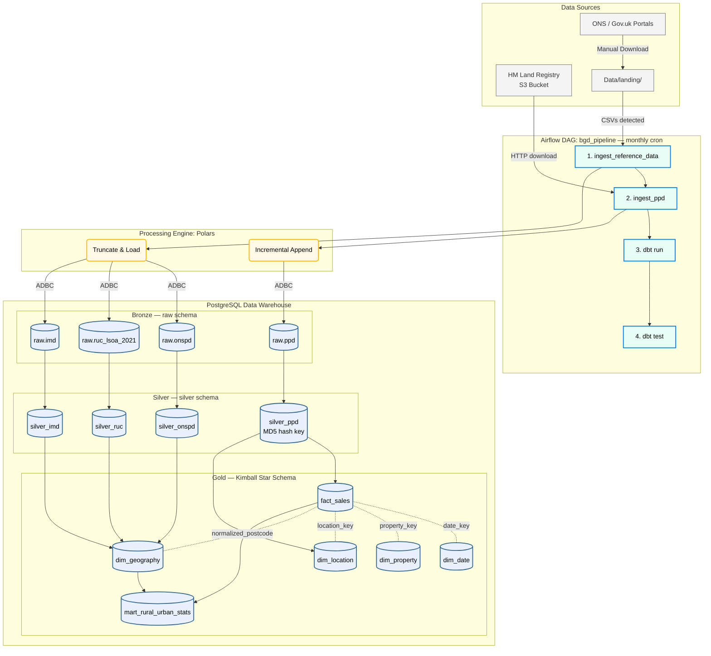

# UK Property Market Analysis – Data Warehouse

## Problem Statement (Analytical Goal)
The primary analytical goal of this data warehouse is to enrich raw UK Property Price Data (PPD) with granular socio-economic context (Index of Multiple Deprivation - IMD) and geographic classifications (Rural-Urban Classification - RUC). By unifying these disparate datasets, we enable analysts and business users to answer critical real estate queries:
- How do property prices and transaction volumes vary across different property types, new builds, and along the rural-urban spectrum?
- To what extent do local neighborhood deprivation factors (e.g., crime rates, education quality, living environment) influence housing valuations?
- What are the long-term trends in property sales when evaluated against neighborhood quality and geographic density?

---

## Architecture Overview

The project follows a **Medallion Architecture** (Bronze → Silver → Gold) orchestrated by **Apache Airflow** and powered by **Polars** for high-speed ingestion. All transformations from Silver onwards are managed by **dbt**.

```
┌─────────────────────────────────────────────────────────────────┐
│  Data Sources (UK Gov)                                          │
│  • PPD  – auto-downloaded by Polars from Land Registry URLs     │
│  • ONSPD / RUC / IMD – manually dropped into Data/landing/      │
└──────────┬──────────────────────────────────────────────────────┘
           ▼
┌─────────────────────────────────────────────────────────────────┐
│  Airflow DAG: bgd_pipeline  (runs 25th of each month)           │
│                                                                 │
│  1. sense_landing_zone   – FileSensor watches Data/landing/     │
│  2. ingest_reference_data – Polars Truncate & Load → Bronze     │
│  3. ingest_ppd            – Polars incremental append → Bronze  │
│  4. dbt_run_silver        – dbt run  --models silver_ppd        │
│  5. dbt_test              – dbt test --models silver_ppd        │
└──────────┬──────────────────────────────────────────────────────┘
           ▼
┌─────────────────────────────────────────────────────────────────┐
│  PostgreSQL (Kimball Star Schema)                               │
│  • dim_geography  • dim_property  • dim_location  • dim_date    │
│  • fact_sales     • mart_rural_urban_stats                      │
└─────────────────────────────────────────────────────────────────┘
```



### Processing Paradigm
This is a **batch processing** pipeline. The UK Land Registry publishes Price Paid Data updates roughly on the 20th working day of each month. Airflow is scheduled to run on the **25th** as a safe buffer. Reference datasets (ONSPD, RUC, IMD) update infrequently (quarterly/annually) and are loaded via a file-drop landing zone pattern.

---

## Repository Structure

```
BGD/
├── airflow/
│   └── dags/
│       └── bgd_pipeline.py          # Airflow DAG (orchestration logic)
├── bgd_dbt/
│   ├── models/
│   │   ├── silver/                   # Cleansing & standardization layer
│   │   │   ├── silver_ppd.sql        # Incremental with MD5 hash key
│   │   │   ├── silver_onspd.sql
│   │   │   ├── silver_ruc.sql
│   │   │   └── silver_imd.sql
│   │   └── gold/                     # Kimball Star Schema
│   │       ├── dim_geography.sql
│   │       ├── dim_property.sql
│   │       ├── dim_location.sql
│   │       ├── dim_date.sql
│   │       ├── fact_sales.sql
│   │       └── mart_rural_urban_stats.sql
│   ├── docker_profiles/profiles.yml  # dbt profile for container networking
│   └── dbt_project.yml
├── Data/
│   ├── landing/                      # Drop reference CSVs here for Airflow
│   ├── pp-complete.csv               # 30M+ row PPD history (not in Git)
│   └── ONSPD_FEB_2026/              # ONS Postcode Directory (not in Git)
├── docker-entrypoint-initdb.d/       # Bootstrap scripts (first-run schema + data)
│   ├── 00_schema.sql
│   ├── 01_ppd.sql
│   ├── 02_onspd.sql
│   ├── 03_ruc.sql
│   └── 04_imd.sql
├── docker-compose.yml                # Postgres + pgAdmin + Airflow
├── ingest_to_bronze.py               # Polars ingestion script (single entry point)
├── requirements.txt
├── ORCHESTRATION_README.md           # Detailed Airflow usage guide
└── README.md                         # ← You are here
```

---

## Medallion Layers (dbt)

### 1. Silver Layer (Staging & Cleansing)
- **`silver_ppd`**: Normalizes postcodes, generates composite MD5 hash keys, runs incrementally (only processes rows with `transfer_date` newer than the current Silver max).
- **`silver_onspd`**: Deduplicates postcodes, extracts coordinates and LSOA codes (2011 & 2021).
- **`silver_ruc`**: Standardizes rural/urban classification attributes.
- **`silver_imd`**: Casts string IMD matrices into numeric scores and deciles.

### 2. Gold Layer (Kimball Star Schema)
- **`dim_geography`**: Joins ONSPD ↔ RUC ↔ IMD via LSOA codes into a single postcode lookup.
- **`dim_property`**: Unique property type / tenure / new-build combinations.
- **`dim_location`**: Retains street-level address data (PAON, SAON, street, town, county).
- **`dim_date`**: Date spine from 1990 to 2030.
- **`fact_sales`**: Incremental transaction fact with foreign keys to all dimensions.
- **`mart_rural_urban_stats`**: Pre-aggregated data mart for BI dashboarding.

---

## Quick Start

### 1. Start the Full Stack
```bash
docker compose up -d
```
This starts **PostgreSQL**, **pgAdmin**, and **Airflow** (webserver + scheduler). On first run, the init scripts in `docker-entrypoint-initdb.d/` bootstrap the Bronze schema and load the historical CSVs.

| Service       | URL                         | Credentials                    |
|---------------|-----------------------------|--------------------------------|
| Airflow UI    | http://localhost:8080        | `admin` / `admin`              |
| pgAdmin       | http://localhost:5050        | `admin@admin.com` / `admin`    |

### 2. Trigger the Pipeline

**From Airflow UI:**
1. Navigate to **DAGs → bgd_pipeline**.
2. Click **Trigger DAG** (▶).
3. Pass `{"ppd_mode": "full"}` for a full refresh, or leave empty for incremental.

**From CLI:**
```bash
# Incremental (default)
airflow dags trigger bgd_pipeline

# Full Refresh
airflow dags trigger bgd_pipeline --conf '{"ppd_mode":"full"}'
```

### 3. Load Reference Data
Download new ONSPD / RUC / IMD CSVs from the government portals and drop them into `Data/landing/`. Airflow will auto-detect, ingest, and archive them.

### 4. Run dbt Manually (optional)
```bash
docker run --rm --network bgd_default -v $(pwd)/bgd_dbt:/usr/app -w /usr/app python:3.10-slim \
  /bin/bash -c "pip install dbt-postgres==1.8.2 && dbt deps && dbt run --profiles-dir ./docker_profiles --full-refresh"
```

### 5. Shutdown
```bash
docker compose down
```
